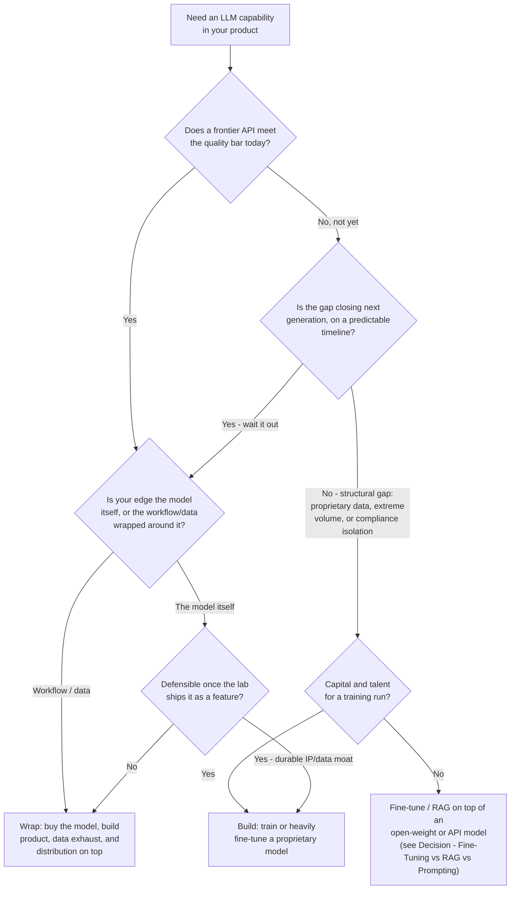

# Decision - Build vs Buy vs Wrap

> **The decision in one sentence:** as of 2026, the default for the 80% case is **buy or wrap**. Pretraining a frontier model costs $100M-$1B+, and deflating token prices make owning one economically irrational for everyone except labs and a handful of vertical/sovereign plays. The question almost every team actually faces is "wrap well or wrap thin?"

## Decision flow

## Tradeoff matrix

| | Build | Buy (raw API) | Wrap (product on API) |
|---|---|---|---|
| **Upfront cost** | $100M-$1B+ for a frontier-class pretrain (E1 estimate); lower but still $1M-$10M+ for a serious fine-tune of an open-weight base | Near zero; pay per token | Near-zero model cost; the real cost is product engineering |
| **Time to capability** | 6-18+ months of training before anything ships | Immediate | Immediate, bounded by product build time |
| **Ongoing cost trajectory** | Your own compute plus a retraining cadence to keep up with frontier releases | Falls with [[Concept - Token Price Deflation]], but you don't control the curve | Same as buy, plus product COGS (see [[Concept - Unit Economics of LLM Products]]) |
| **Platform risk** | None; you are the platform | High: a lab can ship your feature for free in a point release | High, mitigated only by owning something the lab doesn't (workflow, data, integrations) |
| **Defensibility if it works** | Strongest, if the model itself is the product (rare outside labs) | None on its own | Depends entirely on what's wrapped; see the "thin wrapper" test below |
| **Who actually does this (2026)** | Frontier labs; a few sovereign/vertical plays (e.g., regulated-industry, on-prem models) | Prototype-stage teams, low-differentiation internal tools | Nearly all successful AI-native product companies |
| **Failure signature** | Burns capital on a model that's obsolete against the frontier before it ships | Commodity product with no moat, exposed to the lab's own first-party feature | "Thin wrapper" collapse; see Jasper below |

## The details that flip the decision

### Why buy or wrap is the default

Pretraining a frontier-class model costs an estimated **$100M-$1B+** (E1, estimates compiled around frontier lab economics; no public, audited per-model figure exists, see [[Breakdown - Frontier Lab Economics]]). Meanwhile [[Concept - Token Price Deflation]] makes the API alternative cheaper every quarter you wait. Build only pays when the marginal cost of *not* owning the model exceeds that capital outlay. That's true for a handful of labs racing for frontier capability, and for specific verticals with proprietary data, extreme sustained query volume, or hard regulatory/data-residency requirements no API vendor will meet. For nearly everyone else, building is a distraction from the product problem. The calibrated middle ground is fine-tuning an open-weight base, which gets some of build's control without its capital cost ([[Decision - Fine-Tuning vs RAG vs Prompting]]).

### The thin-wrapper test

"Thin wrapper" is the insult for a product that adds nothing a model vendor won't ship for free next release. Nearly everyone wraps a foundation model, so wrapping isn't the issue. What matters is whether the wrapper owns anything durable. Ask: do you own the **workflow**, the **data exhaust** it generates, the **integrations** that make switching costly, and the **distribution** channel to the user? Or just a prompt template and a thin UI around someone else's completion endpoint? [[Concept - Moats in the AI Application Layer]] catalogs what a durable wrap looks like mechanically.

### Cursor: wrap done right

Cursor (Anysphere) wraps Anthropic and OpenAI models and still built a business valued at **$9.9B** with **$500M+ ARR by June 2025** (E2, TechCrunch, June 2025). So wrapping isn't inherently weak. Cursor's durability came from the IDE workflow, deep codebase-context retrieval, and the switching cost of a developer's daily tool. A model API provides none of those, and OpenAI or Anthropic can't easily copy them without becoming an IDE company. Full mechanism in [[Breakdown - The Cursor Ramp]].

### Jasper: platform risk, timeline corrected

Jasper raised a **$125M Series A at a $1.5B valuation on October 18, 2022** (E3, TechCrunch/PR Newswire, Oct 2022). ChatGPT launched **November 30, 2022**, about six weeks later. Its free, general-purpose writing undercut Jasper's core product (AI copywriting), which had no moat beyond prompt templates over GPT-3.

The damage took a while. Jasper cut its 2023 ARR forecast by at least 30% and ran layoffs in July 2023, and an internal valuation reset of roughly 20% (down toward ~$1.2B) followed in **September 2023**. That's about ten months after ChatGPT's launch, not "a month after" as simplified tellings sometimes claim (E2, The Information, Maginative reporting, Sept 2023). The lesson survives the correction. A wrapper with no data moat, no workflow lock-in and no distinct integration surface inherits its vendor's roadmap as direct competition, and the erosion can take months to reach the numbers even when the threat is obvious. More cases in [[Lore - AI Wrapper Graveyard]].

### Platform risk is a spectrum

Before wrapping, ask: "if [the model vendor] shipped this exact feature natively next quarter, would my product still have a reason to exist?" A "no" doesn't mean don't wrap. It means you need the data/workflow/distribution moat *before* you scale, not after a competitor's roadmap update exposes the gap.

### Buy is rarely permanent

The strongest pattern among teams that eventually build something: start on the best available API to find product-market fit fast, instrument [[Concept - Unit Economics of LLM Products]] carefully, and later self-host or fine-tune only the slice of traffic (often as little as 5%) where unit economics or control (latency, compliance, cost at volume) demand it. You avoid paying build's capital cost before knowing the product justifies it, and the fine-tune/self-host call gets made on real usage data instead of a guess.

## Connections

- [[Concept - Moats in the AI Application Layer]] — the mechanics of what makes a "wrap" durable rather than thin; the direct answer to "what should I own besides the prompt?"
- [[Breakdown - Frontier Lab Economics]] — the cost structure behind the $100M-$1B+ "build" estimate, and why only labs can absorb it.
- [[Lore - AI Wrapper Graveyard]] — further case studies of wrappers that collapsed on platform risk, beyond Jasper.
- [[Breakdown - The Cursor Ramp]] — the full mechanism behind the wrap-done-right counter-example.
- [[Concept - Unit Economics of LLM Products]] — the ongoing cost discipline a "buy"/"wrap" choice commits you to, since you don't control the token price curve.
- [[Concept - Token Price Deflation]] — the reason waiting to "build" gets cheaper every quarter the "buy" alternative is chosen instead.
- [[Playbook - Picking Profitable AI Use Cases]] — the upstream decision (which use case to pursue) that should precede this one.
- [[Deep Dive - Agentic Coding in Production]] — a domain (coding agents) where the build/buy/wrap calculus has played out concretely and repeatedly.
- [[Decision - Fine-Tuning vs RAG vs Prompting]] — the technical-layer decision that sits inside "build" or "wrap" once you've chosen a lane: how much do you customize the model you didn't pretrain yourself.
- [[Breakdown - vLLM]] — the self-hosting infrastructure that makes the "selectively self-host the 5%" endgame technically feasible.

## Sources

- TechCrunch, PR Newswire — Jasper $125M Series A at $1.5B valuation (Oct 18, 2022).
- The Information, Maginative — Jasper internal valuation cut ~20%, ARR forecast cut, layoffs (Sept 2023 reporting).
- TechCrunch, "Cursor's Anysphere nabs $9.9B valuation, soars past $500M ARR" (June 5, 2025).
