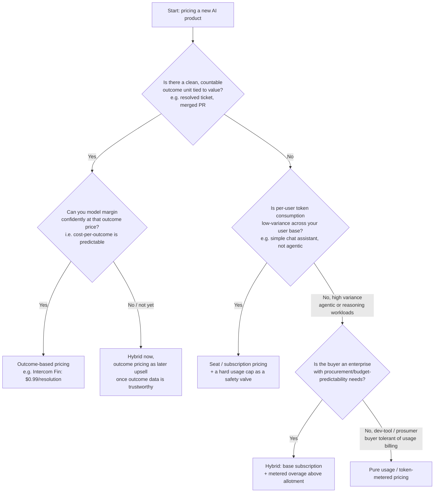

# Decision - Pricing Models for AI Products

> **The decision:** how to price a product whose marginal cost (inference) varies per user and keeps falling, unlike traditional software where marginal cost is near zero and flat. **Default for the 80% case in 2026:** a hybrid model — flat base subscription plus metered usage overage above a generous included allotment — because it gives enterprise buyers the procurement predictability a flat fee provides while keeping a cost-aligned release valve against the heaviest users. Pure seat pricing and pure usage pricing are both correct only at the extremes described below.

## Decision flow

## Tradeoff matrix

| Model | Margin safety vs. usage variance | Buyer predictability | Alignment with delivered value | Repricing burden as tokens deflate | 2025-2026 examples |
|---|---|---|---|---|---|
| **Per-seat / subscription** | Low — a heavy user on a flat seat can be gross-margin-negative | High — buyer loves a flat number | Low — price is decoupled from work done | High — locked price either bleeds margin or gets undercut within a year | GitHub Copilot Business, $19/user/mo (E2, GitHub, 2026) — moved to usage-based AI credits starting Jun 2026 after seat pricing couldn't absorb variable coding-agent consumption |
| **Pure usage / token-metered** | High — cost tracks consumption directly | Low — unpredictable bills stall enterprise procurement cycles | High — pay for what you use | Low for the vendor, but customer bills swing with every price change | Raw LLM API pricing (OpenAI, Anthropic, per-token) |
| **Credit / hybrid** | Medium-high — overage absorbs tail usage, base covers light users | Medium-high — base fee is predictable, overage is the known risk | Medium — better than flat seat, coarser than true usage | Medium — only the overage rate needs retuning, not the whole plan | Cursor (shifted from fixed 500 premium requests/mo to credit-based billing, Jun 2025, E2); Windsurf (overhauled credit pools into daily/weekly quotas, Mar 19 2026, E2); ChatGPT Plus/Pro tiers |
| **Outcome-based** | High if the outcome is well-scoped; risky if attribution is gameable | High — buyer pays only for results, easiest sell against a human baseline | Highest — price literally is the value unit | Low — deflation flows straight into vendor margin, not customer price | Intercom Fin: $0.99 per resolution or successful handoff, 50-outcome/mo minimum (E3, Intercom published pricing, 2026); real resolution rates run 42-50% in practice |

## The details that flip the decision

- **Agentic and reasoning workloads break flat pricing hardest.** A single autonomous multi-step task can consume 10-100x the tokens of one chat turn, so any product built around [[Deep Dive - Agentic Coding in Production]]-style workloads should default toward hybrid or usage pricing even if the rest of this matrix would favor seats — flat pricing under agentic load is the fastest way to go margin-negative. This is exactly what forced Cursor's and Windsurf's 2025-2026 repricing (see [[Breakdown - The Cursor Ramp]]) and what pushed GitHub Copilot off flat seats in June 2026.
- **Pure usage pricing can lose the deal before it starts.** Even when usage pricing is the economically "correct" choice, unpredictable line-item bills are a known blocker in enterprise procurement — budget owners will pick a worse-aligned but predictable flat or hybrid plan over a better-aligned but volatile one. This is why hybrid, not pure usage, became the default enterprise structure through 2026 rather than usage pricing outright (E1, Bessemer/OpenView pricing analyses, 2025-2026).
- **Outcome pricing only works when the outcome is cleanly attributable and clearly cheaper than the human alternative it replaces.** Intercom can price per resolution because "resolution" is a definable, auditable event in a support workflow (link [[Concept - Support Deflection Economics]] for the deflection math underneath it). Most workflows don't have as clean an outcome unit yet, and a gameable outcome definition (e.g., "resolution" counted before a customer reopens the ticket) becomes a liability, not a moat — see [[Concept - Outcome-Based Pricing]] for the attribution and gaming problems in depth.
- **A repricing fight is not a bug, it's the model working as intended.** When Anthropic tested removing Claude Code from the Pro plan for a small slice of new users in April 2026 and reversed the change within 24 hours after backlash, that was the hybrid model's overage boundary being renegotiated in public — an expected recurring event under token deflation, not a one-off misstep (E2, reporting, 2026).
- **Deflation is a tailwind only if your pricing decouples from cost.** Because token cost falls roughly an order of magnitude per year (see [[Concept - Token Price Deflation]]), a price anchored to today's token cost is stale within a year regardless of model chosen. The structures that route deflation into vendor margin (hybrid with sticky base price, outcome-based) beat structures that pass it straight to the customer (naive usage pricing, which gets undercut) — see [[Concept - Unit Economics of LLM Products]] for the COGS math this rests on.

## Connections

- [[Concept - Unit Economics of LLM Products]] — the fully-loaded COGS math (inference, retries, oversight) each pricing model is trying to cover.
- [[Concept - Outcome-Based Pricing]] — deep treatment of when outcome pricing works and how attribution gets gamed.
- [[Concept - Token Price Deflation]] — the falling-cost trend that forces annual repricing regardless of model chosen.
- [[Concept - Support Deflection Economics]] — the underlying value math that makes Intercom-style per-resolution pricing defensible.
- [[Deep Dive - Agentic Coding in Production]] — the high-variance workload pattern that breaks flat and even simple usage pricing.
- [[Breakdown - The Cursor Ramp]] — a real pricing-model transition (fixed requests to credits) traced end-to-end.
- [[Playbook - Measuring AI ROI]] — how a buyer should evaluate whether any of these prices is actually worth paying.
- [[Concept - Cost Engineering for LLM Applications]] — the vendor-side levers (caching, routing, batching) that determine how much margin any of these models actually leaves.

## Sources

- GitHub, Copilot Business pricing and June 2026 usage-based billing transition (GitHub Docs/Blog, 2026).
- TechCrunch / reporting on Cursor's shift from fixed premium requests to credit-based billing (Jun 2025).
- Reporting on Windsurf's pricing overhaul from credit pools to daily/weekly quotas (Mar 19, 2026).
- Intercom, Fin AI Agent pricing documentation — $0.99 per resolution/outcome, 50-outcome monthly minimum (2026).
- Reporting on Anthropic's April 2026 Claude Code Pro-plan test removal and 24-hour reversal.
