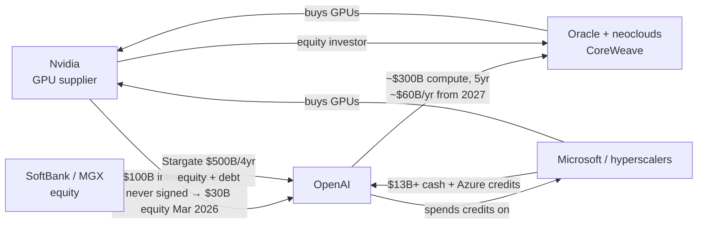

# Deep Dive - Circular Financing in the AI Buildout

> **One-paragraph hook:** In 2025-26 the same few balance sheets (Nvidia, a few frontier labs, three or four hyperscalers, a set of neoclouds) started financing each other's purchases in loops. Nvidia announces intent to put up to $100B into OpenAI. OpenAI commits ~$300B to Oracle for compute. Oracle and the neoclouds buy Nvidia GPUs, and Nvidia is also an equity investor in a neocloud (CoreWeave). Capital and chips circulate inside a closed set of players. The bear case calls this a supplier manufacturing its own demand, the Lucent/Nortel telecom-vendor-financing pattern that preceded the 2001 bust. The bull case calls it ordinary strategic infrastructure investment that de-risks a buildout ahead of demand. The unnerving part: **you cannot tell which it is from the deal structure.** The same transactions are prudent or a bubble depending on whether real end-user demand shows up to consume the compute, and nobody has that number yet.

## The mechanism

"Circular financing" (also *vendor financing*, or *round-tripping* in its pathological form) means a supplier provides the capital its customer uses to buy the supplier's product. Part of the supplier's booked revenue is its own money coming back. Capital-intensive infrastructure has often been seeded this way, and it isn't inherently fraudulent. It does have a specific failure mode: **it can inflate reported demand above true end-market demand, and the gap stays hidden until the customer has to service the obligation from real cash flow instead of more financing.**

Three properties make the AI version distinctive:

1. **Concentration.** The loops run through ~6-8 entities (Nvidia; OpenAI, Anthropic, xAI; Microsoft, Amazon, Google, Oracle; CoreWeave and other neoclouds). A shock to any node hits all of them at once; the counterparty set has no diversification.
2. **Magnitude vs revenue.** Committed capex exceeds current AI revenue by roughly an order of magnitude, and that gap is the whole controversy. [[Breakdown - Frontier Lab Economics]] covers the burn side and [[Reference - AI Market Sizing Claims]] the revenue side.
3. **Non-cash and contingent structure.** Much of the "investment" is progressive, contingent on deployment milestones, or pre-purchased capacity instead of cash. That makes the loops harder to value and easier to announce than to close.

The framing equation is Sequoia partner David Cahn's **"$600B question"** ([[Reference - AI Venture Funding Patterns]] tracks the raises behind it). Published June 2024 (E1, Sequoia, updated from his September 2023 "$200B question"), it takes Nvidia's data-center revenue run-rate, doubles it to cover the other half of data-center total cost of ownership (power, buildings, cooling), then doubles again to imply a 50% end-user gross margin. The result, on the order of $600B/yr of AI end-revenue needed to justify the capex, dwarfs the actual tens of billions of lab revenue. By 2026 the five largest Western hyperscalers alone were guiding to roughly **~$725-750B of 2026 capex (analyst tallies vary), up from ~$410B in 2025** (E1/E2, PitchBook/hyperscaler guidance via analyst tallies; Bloomberg Intelligence, Jun 2026), pushing the implied revenue requirement higher still.

## Architecture / walkthrough

The loops as of mid-2026. Solid arrows are capital flowing *out*, and most of it ends up back at Nvidia:

Trace one dollar. Nvidia announced intent to invest **up to $100B in OpenAI** (E2, letter of intent, Sept 22 2025). It never became a contract. Nvidia's CFO conceded in December 2025 that the pact was "still not definitive". The WSJ reported (Jan-Feb 2026) that talks went "on ice" over internal Nvidia doubts about OpenAI's business model, with the *circularity itself* as the stated concern, and no money ever changed hands (E2, WSJ/Fortune/CNBC, Dec 2025-Feb 2026). It was superseded by a ~$122B OpenAI round that closed **March 31 2026** (Amazon led ~$50B, SoftBank ~$30B, Nvidia ~$30B). In that round **Nvidia's stake was a plain equity check unconditional on gigawatt-deployment milestones**. The financier balked at bankrolling its own demand, so the loop was deliberately de-circularized. Treat any unsigned headline "$X00B commitment" as an announced ceiling, not booked cash.

Next leg: OpenAI signs a **~$300B, five-year, ~$60B/yr compute contract with Oracle** starting 2027 (E2, reporting, Sept 2025). Oracle and the neoclouds spend it on Nvidia GPUs, and the dollar is back home. **Project Stargate** ($500B over four years, $100B initial deployment, announced Jan 21 2025 with SoftBank/Oracle/MGX equity, E2) routes more capital down the same path. Nvidia is also *supplier to and equity investor in* CoreWeave, which closes a second loop. Each arrow is defensible alone. Together they form a ring.

What decides it: **whether the dollar completes a productive cycle depends on the customer at the end of the chain**, the enterprise or consumer paying to run inference. If they show up, this is railroad-and-telegraph infrastructure financing and the loops unwind into profit. If they don't, the compute is stranded and the obligations (many debt-financed) come due against revenue that never arrived. The deal structure says nothing about which world you're in.

## In practice

### The bear read: vendor financing

In the late 1990s Lucent and Nortel lent telecom carriers the money to buy Lucent/Nortel switching gear. Reported equipment demand looked enormous, and a large slice of it was the vendors' own balance sheets. When the CLECs couldn't service the debt, demand evaporated, the vendor loans went bad, and the 2001 telecom bust followed (E1, historical analogy; the mechanism rhymes, the scale and asset differ). Applied here: a supplier funding its customers' purchases can manufacture revenue that isn't end-demand, and a closed counterparty set means the correction hits everyone at once.

### The bull read: ordinary infrastructure capex

Every capital-intensive general-purpose technology (railroads, electrification, telecom, cloud) was built ahead of demand with strategic capital that de-risked the buildout. Circular doesn't mean fraudulent. Putting equity into a customer to accelerate a market you'll profit from is standard. And unlike dark fiber, compute is *fungible and re-priceable*, not a single-purpose sunk asset. If [[Concept - Token Price Deflation]]'s Jevons dynamic holds (cheaper tokens expand usage faster than price falls), demand arrives to fill the compute. [[Deep Dive - Bubble or Boom]] has the full scenario spread.

### Where they collide: the DeepSeek shock

On January 27 2025, DeepSeek's cheap-frontier R1 release knocked **$589B off Nvidia's market cap in a single day, the largest one-day loss in US market history** (E3, CNBC/Bloomberg, Jan 27 2025). That's the concentration risk in practice: one efficiency shock, hinting that frontier capability might need far less compute than the buildout assumes hit every node of the ring simultaneously. Whether it was an overreaction (usage did not collapse) or a preview (the capex thesis breaks under efficiency gains) is the open question.

## Failure modes

- **Revenue never arrives.** End-user AI revenue plateaus in the tens of billions while capex commitments compound into the hundreds of billions. Result: stranded compute, defaulted GPU-backed debt, synchronized write-downs across the closed counterparty set. Detection: watch the gap between hyperscaler capex outflow and AI-segment operating income, and any lab missing revenue guidance while its capex commitments stand.
- **Depreciation mismatch.** The loops assume multi-year GPU cash flows to service GPU-backed debt (CoreWeave-style). If real useful life is shorter than the 5-6 year book schedules (see [[Concept - GPU Depreciation and Compute Capex Accounting]]), depreciation is understated, reported AI margins look better than reality, and debt-coverage math tightens fast. Michael Burry's Nov 2025 estimate put the industry understatement at ~$176B across 2026-2028 (E2, his own estimate; contested by the "waterfall" counter that chips keep earning on inference).
- **Contingencies unwind.** Announced ≠ signed ≠ funded. Much of the headline capital is LOI-stage or milestone-contingent, and the flagship deal is the textbook case: the Nvidia **$100B** OpenAI intent **was never signed**, stalled by Jan 2026, and shrank to a ~$30B unconditional equity stake by March 2026 (E2, WSJ/CNBC). A tighter financing market or one partner dispute can turn a "$300B deal" back into a press release. Detection: track announced-vs-consummated conversion.

## The non-obvious

**Circular financing and ordinary capex are the same transactions, so the deal structure can't tell you which one you're looking at.** People keep hunting for a smoking gun in *how* the deals are wired (equity vs credits vs pre-purchase, who invests in whom). There isn't one. A strategic investment that de-risks a real market and a vendor loan that manufactures fake demand look *identical* on the term sheet. What separates them is a number that exists only in the future: **does enough real end-user demand show up to consume the compute at a price that services the obligations?** Anyone confidently saying "it's clearly a bubble" or "it's clearly fine" is smuggling in an unstated forecast of that number. The honest position is that the structure tells you nothing, and the debate is about demand elasticity, which is why it stays unresolved. [[Reference - The AI Forecasting Track Record]] and [[Concept - The AGI Timeline Debate]] show how badly the field forecasts this kind of number.

## Evolution

In 2023-24 the financing was mostly conventional: hyperscalers (Microsoft into OpenAI, Amazon and Google into Anthropic) took equity stakes partly paid in cloud credits, already a mild loop. The 2025 change was the *direct supplier-to-customer* leg. Nvidia started investing in the labs that buy its chips (Sept 2025 OpenAI LOI), and trillion-dollar-scale multi-year compute contracts (Oracle $300B, Stargate $500B) turned raises into pre-committed spend routed straight to the infra layer. [[Concept - Value Capture Across the AI Stack]] has the value-flow logic.

What comes next depends on demand. If revenue arrives, real cash flow refinances the loops and the training-wheels financing falls away. If it doesn't, the sequence rhymes with 2001, compressed into a smaller, more concentrated set of balance sheets. It's [[Concept - The Pilot-to-Production Gap]] at macro scale: the buildout bets that pilots become production revenue before the financing has to stand on its own. It also sets the backdrop for app-layer fragility ([[Lore - AI Wrapper Graveyard]]): the compute glut or crunch these loops produce sets the token prices every application pays. [[Reference - The 2026 Navigation Cheatsheet]] lists "is the buildout circular?" among the year's defining open questions. The bull case rests on [[Concept - Scaling Laws]]: if returns to compute keep holding, the demand thesis survives.

## Connections
- [[Breakdown - Frontier Lab Economics]] — the burn and revenue side of the gap the loops are trying to bridge.
- [[Reference - AI Venture Funding Patterns]] — the mega-raises (OpenAI $40B, Stargate equity) that feed the loops; how strategic money blurs "funding."
- [[Concept - GPU Depreciation and Compute Capex Accounting]] — the depreciation-schedule assumption the GPU-backed debt in these loops depends on.
- [[Reference - AI Market Sizing Claims]] — the revenue/value numbers against which the $600B gap is measured.
- [[Concept - Value Capture Across the AI Stack]] — why capital routed through the loops ends up captured at the silicon layer.
- [[Concept - Token Price Deflation]] — the Jevons dynamic that the bull case needs to hold for demand to fill the compute.
- [[Lore - AI Wrapper Graveyard]] — the app-layer casualties whose fate depends on the compute prices these loops set.
- [[Deep Dive - Bubble or Boom]] — the full scenario spread and probabilities this note deliberately does not assign.
- [[Reference - The AI Forecasting Track Record]] — how reliably the field has forecast the demand number that settles the debate (poorly).
- [[Concept - The AGI Timeline Debate]] — the capability-timeline assumption underneath every demand forecast for the compute.
- [[Reference - The 2026 Navigation Cheatsheet]] — lists the circular-financing question among the year's load-bearing unknowns.
- [[Concept - The Pilot-to-Production Gap]] — the micro version of the macro bet: the loops assume pilots convert to production revenue.
- [[Concept - Scaling Laws]] — the technical premise of the bull case that more compute keeps buying capability.

## Sources
- Sequoia Capital / David Cahn — "AI's $600B Question" (Jun 2024, updated from "$200B Question" Sep 2023). The framing metric for the capex-vs-revenue gap. (E1)
- NVIDIA / OpenAI — "Strategic Partnership to deploy 10GW" press release + CNBC (Sep 22 2025); Fortune/CNBC (Dec 2025) on the pact remaining non-definitive; WSJ/CNBC (Jan-Feb 2026) that the $100B deal was never signed and money never moved; the ~$122B OpenAI round closing Mar 31 2026 (Amazon ~$50B, SoftBank ~$30B, Nvidia ~$30B unconditional equity). (E2)
- Reuters/SiliconANGLE/DCD — OpenAI-Oracle ~$300B, five-year cloud deal (Sep 2025). (E2)
- OpenAI — "Announcing The Stargate Project" (Jan 21 2025): $500B/4yr, $100B initial. (E2)
- CNBC / Bloomberg — Nvidia -$589B single-day market-cap loss on DeepSeek R1 (Jan 27 2025). (E3)
- Analyst tallies (PitchBook / hyperscaler guidance) — ~$725B 2026 hyperscaler capex vs ~$410B 2025. (E1/E2)
- Michael Burry (Nov 2025) — ~$176B industry depreciation understatement estimate, 2026-2028. (E2, contested — see GPU Depreciation note)
- Historical: Lucent/Nortel telecom vendor financing pre-2001 — analyst analogy, not identity. (E1)
