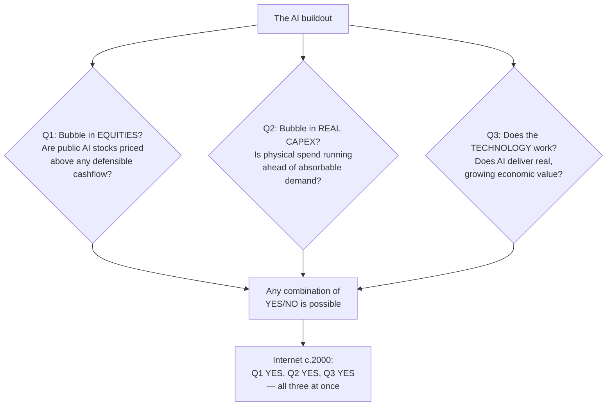

# Deep Dive - Bubble or Boom

> **One-paragraph hook:** By 2026 the AI industry is spending on infrastructure at a rate that dwarfs its revenue, financing much of that demand through deals its own suppliers underwrite, and doing it on hardware whose useful life is itself disputed. That is the textbook shape of a bubble. It is also the textbook shape of every genuine infrastructure revolution in its capital-formation phase. The single most common analytical error in this debate is treating "AI is a bubble" and "AI is transformative" as opposites. They are orthogonal. Both were true of the internet in 2000. This note gives you a framework that keeps them separate, the real numbers on both sides, and the specific signals that would tell you which world you are in.

## The gap, quantified

The bear thesis starts with an accounting gap. Sequoia's David Cahn made it concrete in **"AI's $600B Question" (June 2024, E1, named analyst)**: take Nvidia's data-center run-rate revenue, double it to cover the rest of a data center's total cost of ownership (GPUs are roughly half), then double again for the ~50% gross margin the cloud provider needs — and you get the annual end-user AI revenue required to justify the spend. By mid-2024 that figure implied **~$600B/yr of AI revenue needed against an actual run-rate an order of magnitude lower** (Cahn's earlier September 2023 version was "the $200B question" — the gap *widened* even as OpenAI's revenue doubled, because capex accelerated faster than demand). Cahn's own reading is notably not "bubble" — it is a *timing* argument: the revenue will come, but capital is running years ahead of it, and survival through the gap decides the winners.

Goldman Sachs' Jim Covello sharpened the skeptical edge in the June 2024 report **"Gen AI: Too Much Spend, Too Little Benefit?" (E1, named analyst)**: ~$1T to be spent on data centers, chips, and grid upgrades "with little to show for it so far," and the pointed question — *what trillion-dollar problem does AI actually solve?* Covello's argument is that "replacing low-wage jobs with tremendously costly technology is the polar opposite of prior technology transitions." This is a bank equity-research view, contested inside Goldman itself, and by mid-2026 Covello was still asking the same question ahead of the OpenAI/Anthropic IPO cycle — which is either vindication or a broken clock, depending on your priors.

## Circular financing — the mechanism that makes demand look organic

The structural worry in 2026 is not the size of the spend but its *topology*. Money is moving in a loop:

```
        equity / "investment"
   Nvidia ───────────────────────► OpenAI
     ▲                                │
     │                                │ cloud commitments
     │ GPU purchases                  │ (hundreds of $B)
     │ ("revenue")                    ▼
   Oracle / CoreWeave / clouds ◄──────┘
```

Nvidia invests in OpenAI (a **$100B partnership** announced 2025); OpenAI commits hundreds of billions to clouds like Oracle (**a ~$300B cloud deal**); those clouds buy Nvidia GPUs to build the capacity. Cash leaves Nvidia's balance sheet as an *investment* and returns to its income statement as *revenue*, having laundered through two counterparties into apparent third-party demand. **2026 analyses put the total of such arrangements at $800B+ (E1/E2, Bloomberg and others, 2026).** Vendor financing is not inherently fraudulent — it built the railroads and the telecom networks — but it has two failure properties: it *inflates apparent demand* (the same dollar counts as demand at every hop), and it *magnifies losses on the way down* (if OpenAI's revenue disappoints, the impairment cascades back through Oracle to Nvidia). This is the direct link to the [[Deep Dive - Circular Financing in the AI Buildout]] treatment, which traces the individual deal structures.

## The historical parallel, named

The closest structural analog is not the dot-com equity mania but the **late-1990s telecom fiber overbuild (E2, historical)**. Vendors like Lucent and Nortel financed their own customers (CLECs) to buy switching gear; carriers laid ~80M miles of fiber on demand projections that assumed internet traffic would keep doubling every ~100 days. Demand grew fast — just not that fast — and when the vendor financing unwound, bandwidth prices collapsed, ~85-95% of the lit fiber sat "dark," and the equipment makers were destroyed. The instructive part: **the fiber was real, the internet was real, and the traffic did eventually arrive.** The overbuild was a genuine bubble *and* the infrastructure it left behind subsidized the next decade of the web. Vendor-financed capacity ahead of demand is exactly the pattern repeating with GPUs and data centers.

## The accounting fault line: GPU depreciation

The bear case's sharpest empirical claim is about depreciation. Michael Burry (2025-26, a **disclosed short position — not neutral analysis, E1**) argues hyperscalers depreciate GPUs over **5-6 year book schedules** while the real economic useful life is **~2-3 years** (obsolescence from each Nvidia generation plus thermal wear at 100% utilization). Stretching the schedule understates depreciation expense, which mechanically flatters earnings. Burry's estimate: **~$176B of overstated earnings across the big players 2026-28**, with Oracle and Meta profits potentially overstated ~27% and ~21% respectively by 2028. Nvidia's rebuttal is that customers observe 4-6 year utilization in practice. This is not a side issue — it directly determines whether the buildout is profitable, and it is the load-bearing crux shared with [[Deep Dive - The AI Compute Buildout]]. If Burry is right, reported hyperscaler AI margins are partly an artifact of depreciation policy; if Nvidia is right, they are real. As of mid-2026 this is genuinely unresolved.

## The bull specifics

The bull case is not "trust us" — it rests on a measured cost curve and a demand mechanism.

- **Inference cost fell ~1000x in three years (E2, provider price histories).** GPT-4-class output ran ~$30/M tokens in March 2023; by 2026 comparable quality is available under ~$0.50/M, and often ~$0.05-0.10/M from open-weight hosts. a16z's "LLMflation" analysis pegs the sustained pace at ~10x/yr for a fixed quality bar. Each order-of-magnitude price drop is a Jevons event: it opens use cases that were previously uneconomic, so *demand expands as price falls*. This is the core of [[Concept - Token Price Deflation]].
- **Revenue is growing fast in absolute terms**, even if it trails capex. The gap is a ratio problem, not a zero-revenue problem.
- **The MIT NANDA "95% of pilots show no P&L impact" finding (E2, "The GenAI Divide," 2025, ~150 executive interviews / 350-employee survey / 300 deployments, against $30-40B enterprise GenAI spend)** is frequently cited as a bear point but actually cuts the other way: NANDA's authors attribute the failure to *pilot approach*, not model capability — the 5% that worked bought focused solutions and set KPIs. That is a deployment-execution problem, not a technology ceiling. See [[Concept - The Pilot-to-Production Gap]].

## Architecture / walkthrough — the three-question framework

The whole debate collapses into confusion because people argue one question while thinking about another. Separate them:



**Walk a claim through it.** "Nvidia is overvalued" is a Q1 statement and says nothing about Q3. "There's too much data-center capex" is Q2 and says nothing about Q1 or Q3. "AI is useless hype" is a Q3 claim that most evidence contradicts regardless of Q1/Q2. The dot-com era is the proof that all three can be YES simultaneously: pets.com was a genuine equity bubble, the fiber overbuild was a genuine capex bubble, *and* the internet reshaped the entire economy. Conflating the three is the error.

**What to actually track**, quarter over quarter:

| Signal | Bubble-unwind reading | Boom reading | Tier |
|---|---|---|---|
| Revenue / capex ratio | Falling; gap widening | Stabilizing / rising | E1/E2 |
| Circular-financing share of "demand" | Rising toward the $800B loop | Third-party revenue growing | E1/E2 |
| GPU depreciation reality | Real life ≪ book life (Burry) | Utilization holds 4-6 yr (Nvidia) | E1 |
| Real usage: tokens served, DAU | Flat/declining | Still ~10x-ing | E2 |
| Token price vs demand | Price falling, demand *not* expanding | Jevons holds — demand expands | E2 |

If the top three deteriorate together while usage stalls, that is an unwind. If usage keeps compounding while the financing normalizes, it is a boom that merely front-ran its revenue.

## Evolution

The framing matured fast. In 2023 the debate was binary hype-vs-skepticism. Cahn's 2023-24 "$200B → $600B" reframing shifted it to a *timing* question (capital ahead of revenue). Through 2025-26 the center of gravity moved to the accounting layer — GPU depreciation and circular financing — because that is where the numbers are actually contestable and where an unwind would first appear. The likely next phase is empirical resolution: the OpenAI/Anthropic IPO cycle and hyperscaler segment reporting will, for the first time, expose real AI-segment margins to public scrutiny, which is exactly what neither the $600B question nor the depreciation debate could settle from the outside. The successor question to "bubble or boom" is "whose balance sheet holds when the timing gap is longest" — a [[Reference - AI Market Sizing Claims]] and [[Concept - Unit Economics of LLM Products]] problem, not a vibes problem.

## Failure modes

- **Conflating the three questions** (above) — the master error. "It's a bubble, therefore AI is fake" is a non-sequitur.
- **Averaging forecasts into mush.** The bear (Covello, Burry) and bull (Jevons/deflation) cases are not to be split down the middle; they are conditional on the depreciation and revenue/capex facts. Track the facts, don't average the opinions (per the [[Reference - The AI Forecasting Track Record]] discipline).
- **Mistaking timing risk for thesis risk.** The buildout front-runs demand by years; a 12-18 month demand air-pocket triggers a *financial* unwind without disproving the *technology* — see [[Deep Dive - The AI Compute Buildout]].
- **Taking any single number clean.** Every headline here is tiered E1/E2 and often walked back. Cahn's own conclusion is not "bubble." Covello is contested inside his own bank. Burry holds a disclosed short. Provenance is load-bearing.

## The non-obvious

The thing practitioners internalize the hard way: **a real bubble tells you nothing about whether the technology is useful.** The instinct to reason "capex is irrational → therefore AI won't matter" is precisely backwards — the internet was a *genuine* bubble and *still* reshaped the economy, and the fiber laid in the bubble is what made YouTube possible five years later. If you are deploying AI, the equities question (Q1) and even the capex question (Q2) are almost irrelevant to you; only Q3 — does it deliver value in *your* task — should drive your decisions. The market can be in a bubble while your specific use case is one of the 5% with real ROI. Conversely, a roaring market says nothing about whether your thin-wrapper product survives — for that, see [[Concept - Moats in the AI Application Layer]] and [[Concept - What Stays Valuable Through Any Scenario]]. The correct posture is to be a bubble agnostic and a use-case fundamentalist.

## Connections
- [[Deep Dive - The AI Compute Buildout]] — the physical/engineering companion; the depreciation and power facts that make the finance question concrete.
- [[Deep Dive - Circular Financing in the AI Buildout]] — the frontier-level deep treatment of the vendor-financing deal structures summarized here.
- [[Concept - Token Price Deflation]] — the ~10x/yr cost curve that powers the Jevons demand engine at the heart of the bull case.
- [[Breakdown - Frontier Lab Economics]] — the lab P&L detail (burn, gross margin) that the revenue/capex gap is measured against.
- [[Concept - Unit Economics of LLM Products]] — whether individual products clear a margin is the microfoundation of the macro question.
- [[Reference - AI Market Sizing Claims]] — the demand-side numbers (TAM estimates) whose credibility the $600B gap tests.
- [[Concept - The Pilot-to-Production Gap]] — the MIT 95%-fail finding is about deployment execution, not capability; it belongs on the bull side.
- [[Concept - Moats in the AI Application Layer]] — a boom does not save an undefensible position; this is what survives either way.
- [[Concept - The Data Wall]] — a supply-side constraint that, if it binds, changes the demand curve the capex is betting on.
- [[Concept - What Stays Valuable Through Any Scenario]] — the practitioner's answer to "which world are we in": positions robust to both.
- [[Reference - The AI Forecasting Track Record]] — why you track facts (revenue/capex, depreciation) rather than average pundit opinions.
- [[Concept - The AGI Timeline Debate]] — the capability-timeline question is orthogonal to the market question; conflating them is the master error.
- [[Reference - The 2026 Navigation Cheatsheet]] — the no-regret moves that hold in both bubble and boom.
- [[Lore - Failed AI Predictions]] — the graveyard of confident calls on both the hype and the "AI winter" sides.
- [[Reference - AI Impact by Business Function]] — where real, measurable revenue is actually landing, function by function.
- [[Concept - Cost Engineering for LLM Applications]] — the discipline that converts the deflating cost curve into an actual margin.
- [[Concept - Scaling Laws]] — the technical premise (capability rises with compute) that the entire capex bet capitalizes.
- [[Reference - The Open Questions Ledger]] — "bubble or boom?" is tracked there as a live, unresolved question with resolution criteria.

## Sources
- Cahn, D. (2023, 2024) — "AI's $200B/$600B Question," Sequoia Capital. The canonical statement of the capex-revenue gap and its 4x TCO/margin derivation.
- Covello, J. et al. (2024) — "Gen AI: Too Much Spend, Too Little Benefit?", Goldman Sachs Research. The bank-skeptic $1T "little to show for it" view; contested internally.
- Bloomberg and others (2026) — reporting on Nvidia/OpenAI/Oracle circular financing, ~$800B+ in arrangements. Demand-inflation and unwind-magnification mechanics.
- Burry, M. (2025-26) — public commentary on GPU depreciation (2-3yr vs 5-6yr) and ~$176B earnings overstatement; disclosed short position.
- MIT Project NANDA (2025) — "The GenAI Divide: State of AI in Business 2025." 95% of pilots show no P&L impact; failure attributed to approach, not capability.
- a16z (2024-25) — "LLMflation": ~10x/yr inference-cost decline for a fixed quality bar.
- Historical: late-1990s telecom fiber overbuild and vendor financing (Lucent/Nortel/CLECs) — the closest structural analog.
